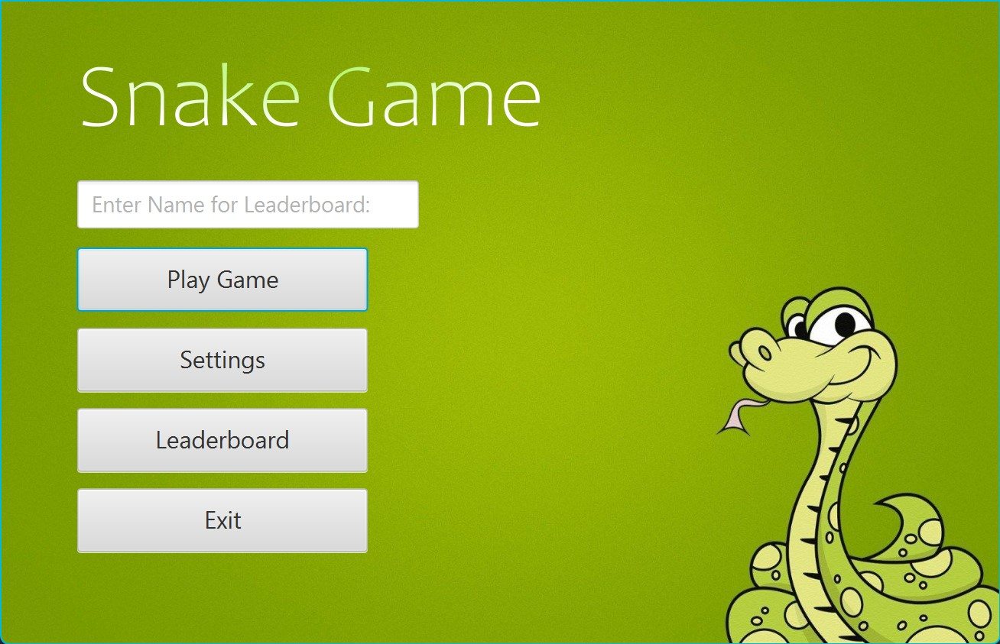
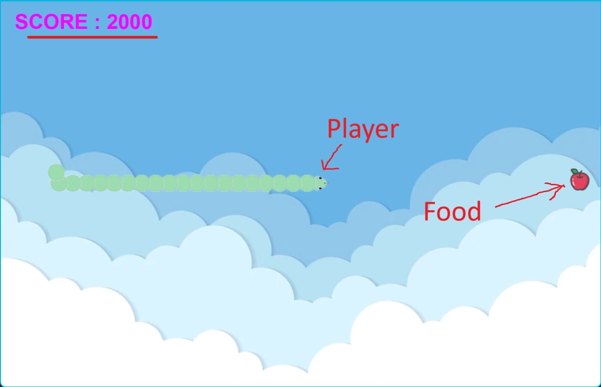

# Snake Project

by Joshua Muiruri

## Project Description

This is a simple version of the classic snake game that has been implemented using java, javafx and swing.The original
source code of the game was flawed and wasn't maintainable. Therefore, the game has been analysed and optimised to make
it maintainable including testing, refactoring classes and file structure, adding Maven, etc. Also, several new features
have been added to make the game better like: a Main menu with settings and a leaderboard, option to pause game and
restart the game when you lose, etc.

## How to Install

Firstly you will have to have Java 21 and Maven installed on your system to work. Then open the project into IntelliJ
IDE as a maven project and build the project. Then go enter "src/main/java/com.snake_game" and run the main function in
the "Menu" Class.

## How to Play

Press play in start screen and the game will then start running. To move the snake you use the arrow keys or WASD.
The goal of the game is to eat as many fruits that appear as possible without hitting the borders or crashing into your
own body. Each fruit is worth 100 points when eaten. Every time you eat a fruit the snakes body increases in size making
it more difficult to survive. Crashing into the walls or yourself will end the game. Good Luck, Have Fun!

## Credits

Special thanks to Sigurður Sigurðardóttir for creating the original source code for this game.